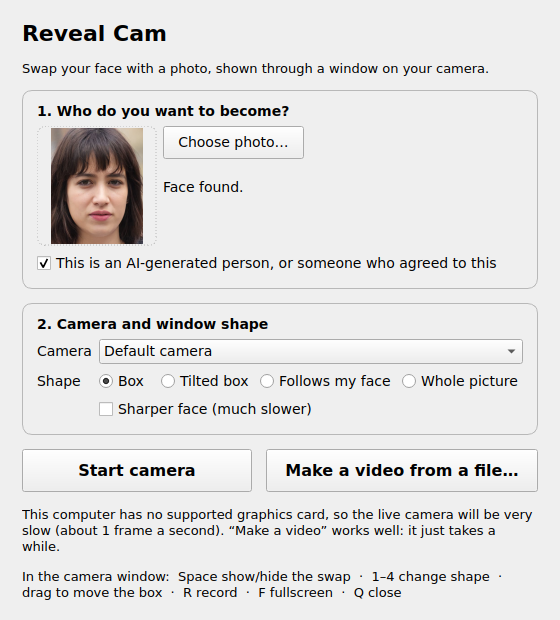

# reveal_cam: real-time face swap through a "reveal window"

`reveal_cam.py` takes a webcam feed (or a video file), swaps the face for a source face, and shows the swap **only inside a reveal window**. That's a shape on screen, like a pane of glass, that turns you into someone else while the rest of the frame stays the real camera feed.

```
output = real * (1 - mask) + swapped * mask
```

It runs entirely on your machine with free models and uses no cloud or paid APIs. The swap models come from [Deep-Live-Cam](https://github.com/hacksider/Deep-Live-Cam) / [InsightFace](https://github.com/deepinsight/insightface).

## Permission: read this first

Only use a source face that is either:

- **an AI-generated face of a fictional person**, or
- **a real person who has given you their consent** to use their face this way.

Don't use this tool to impersonate real people, deceive anyone, get around identity checks, or make content about someone without their permission. Label swapped output as synthetic when you share it. The tool deliberately has no feature for fetching faces from URLs or celebrity databases.

The sample `faces/source.jpg` is a StyleGAN-generated face of a person who does not exist (see [`faces/README.md`](faces/README.md)).

## Easiest way: the app window

1. **Install Python 3.11 or newer** from [python.org](https://www.python.org/downloads/) if you don't have it. On Windows, tick **"Add python.exe to PATH"** in the installer.
2. **Download this folder** and double-click the launcher:
   - **Mac:** `Reveal Cam.command`. The first time, macOS may say it's from an unidentified developer. Right-click it, choose **Open**, then **Open** again.
   - **Windows:** `Reveal Cam.bat`.
   - **Linux:** `start.sh` (or run `./start.sh` in a terminal).
3. **Wait for the one-time setup.** The first launch checks your hardware, then downloads about 1 GB of Python packages and AI models into this folder. Later launches open straight away.
4. **In the window:**
   1. Choose a photo of the person.
   2. Tick the permission box.
   3. Pick your camera and a window shape.
   4. Press **Start camera**.

   A camera window opens. Press **Space** to show or hide the swap, **1–4** to change the shape, and **Q** to close it.



On a computer without a supported graphics card, the live camera runs at about 1 frame a second. Use **Make a video from a file…** instead: pick a clip, and you get a new video with the swap and the original sound.

### What photo to use

- **A clear, front-facing photo works best:** one person, even light, face not covered.
- **A full-body photo is fine.** The app searches the photo at higher resolution to find a small face, and tells you if the face is too small to give a good likeness.
- **Only the face changes.** The swap uses the person's facial features. Your hair, head shape, body and clothes stay your own.
- Use JPG or PNG. iPhone HEIC photos can't be read, so share or export them as JPG first.

The rest of this README is for running it from a terminal and for customising it.

## Quick start (terminal)

```bash
# 1. Check the hardware and see which path you're on
python3 scripts/check_env

# 2. Create .venv, install the matching onnxruntime, download models
python3.11 scripts/setup.py            # add --enhancer to also fetch GFPGAN

# 3. Run
source .venv/bin/activate              # Windows: .venv\Scripts\activate
python reveal_cam.py                                         # live webcam (GPU machines)
python reveal_cam.py --input clip.mp4 --output out.mp4       # offline (any machine)
```

## Step 1: hardware check

`scripts/check_env` uses only the standard library, so you can run it before installing anything. It reports:

- the OS and its version
- the CPU and its architecture
- the GPU(s): `nvidia-smi`, Apple Silicon, or AMD/Intel via `lspci` or the Windows/macOS system tools
- RAM
- the Python versions it finds

It then picks an ONNX Runtime execution provider and writes the result to `.env_report.json`. `reveal_cam.py` uses that file when `execution_provider: auto` is set.

| Hardware | Provider | Requirements file | Expected result |
|---|---|---|---|
| NVIDIA GPU with CUDA | `CUDAExecutionProvider` | `requirements-cuda.txt` | Smooth live performance |
| Apple Silicon (M-series) | `CoreMLExecutionProvider` | `requirements-coreml.txt` | Live, at a lower frame rate |
| Windows with an AMD or Intel GPU | `DmlExecutionProvider` | `requirements-directml.txt` | Live, depending on the card |
| Intel CPU or integrated graphics | `OpenVINOExecutionProvider` | `requirements-openvino.txt` | Marginal |
| CPU only / older Intel Mac | `CPUExecutionProvider` | `requirements-cpu.txt` | Not real-time: use offline mode |

On a CPU-only machine it says so plainly, and offline mode is the main way to use the tool.

## Setup for each hardware path

`scripts/setup.py` does all of the following for you. Here are the manual equivalents. Every path uses a **project-local** `.venv` and needs **Python 3.11+**.

> **Why 3.11 and not 3.10?** The current Deep-Live-Cam README says "Python 3.11 is the minimum (onnxruntime dropped 3.10)". The pinned onnxruntime builds below have no 3.10 wheels. Python 3.11–3.13 work for every provider package. On macOS, Deep-Live-Cam recommends 3.14 for its own GUI, but `reveal_cam` doesn't need that.

Uninstall any other `onnxruntime*` package first. They share one import name and conflict (see [TROUBLESHOOTING.md](TROUBLESHOOTING.md)).

```bash
python3.11 -m venv .venv && source .venv/bin/activate     # Windows: py -3.11 -m venv .venv; .venv\Scripts\activate
pip uninstall -y onnxruntime onnxruntime-gpu onnxruntime-directml onnxruntime-openvino onnxruntime-silicon
pip install -r requirements-<provider>.txt
python scripts/download_models.py --buffalo [--enhancer]
```

- **NVIDIA (CUDA):** `requirements-cuda.txt` installs `onnxruntime-gpu[cuda,cudnn]==1.26.0`. The `[cuda,cudnn]` extras pull the CUDA 12 runtime and cuDNN 9 into the venv, so the only system-wide requirement is a recent NVIDIA driver (`nvidia-smi` must work). If you already have the CUDA 12 toolkit and cuDNN 9 installed, you can use plain `onnxruntime-gpu==1.26.0` instead.
- **Apple Silicon (CoreML):** `requirements-coreml.txt` uses the official `onnxruntime==1.28.0` macOS arm64 wheel, which includes CoreML. Remove the old `onnxruntime-silicon` fork if you have it. The first run compiles the CoreML models, so it's slow; later runs are fast.
- **Windows + AMD/Intel GPU (DirectML):** `requirements-directml.txt` uses `onnxruntime-directml==1.21.0`. You need DirectX 12 and an up-to-date GPU driver.
- **Intel (OpenVINO):** `requirements-openvino.txt` uses `onnxruntime-openvino==1.21.0`. Newer `onnxruntime-openvino` builds must be paired with a matching `openvino` version; see the Deep-Live-Cam README's pairing table.
- **CPU / Intel Mac:** `requirements-cpu.txt` uses `onnxruntime==1.28.0`, or `1.23.0` on Intel Macs (the last x86_64 macOS wheel).

`ffmpeg` is used for H.264 recording and keeping audio. A system `ffmpeg` on your `PATH` is preferred. Otherwise the binary bundled with `imageio-ffmpeg` (installed into the venv) is used.

### Step 2: stock Deep-Live-Cam baseline (optional)

To confirm the models and backend work using the unmodified upstream app:

```bash
python3.11 scripts/setup_baseline.py      # clones into third_party/Deep-Live-Cam with its own venv
```

It prints the commands to run Deep-Live-Cam's GUI (pick a face, click **Live**) or its command-line mode. `third_party/` is git-ignored. The stock app downloads `buffalo_l` into `~/.insightface`, outside this project.

## Models

All models go in `models/` and are git-ignored. `python scripts/download_models.py` fetches them from the links in the Deep-Live-Cam README:

| File | Size | Purpose |
|---|---|---|
| `inswapper_128_fp16.onnx` | 278 MB | the face swap (InsightFace inswapper). The fp32 `inswapper_128.onnx` also works, and the same speed on CPU. |
| `gfpgan-1024.onnx` | 366 MB | optional GFPGAN v1.4 enhancer (`--enhancer`) |
| `buffalo_l/det_10g.onnx`, `buffalo_l/w600k_r50.onnx` | 180 MB | SCRFD face detector + ArcFace recognizer, extracted from InsightFace's `buffalo_l.zip` (a 280 MB download). Downloaded automatically on first run, or with `--buffalo`. |

The handoff mentioned `GFPGANv1.4.pth`. Deep-Live-Cam now ships GFPGAN as ONNX (`gfpgan-1024.onnx`), which runs on the same onnxruntime provider and avoids a PyTorch dependency, so that's what this project uses.

## Using it

### Live mode

```bash
python reveal_cam.py                       # uses config.yaml
python reveal_cam.py --source faces/someone_consenting.jpg --mask quad --feather 40
python reveal_cam.py --camera 1 --width 1920 --height 1080
python reveal_cam.py --record              # start recording immediately
python reveal_cam.py --virtual-cam         # also send output to OBS Virtual Camera / v4l2loopback
```

#### Keyboard controls (preview window)

| Key | Action |
|---|---|
| `1` `2` `3` `4` | Mask mode: **rect** / **quad** (tilted) / **face**-follow / **full** frame |
| `m` | Cycle mask mode |
| `space` | Animate the reveal open / closed |
| `a` / `d` | Cycle animation style (wipe, slide, scale, fade) / direction (left, right, up, down) |
| `[` / `]` | Feather −5 / +5 px |
| `b` | Border line on/off |
| mouse drag | **rect:** drag inside to move, drag a corner to resize, drag outside to draw a new box. **quad:** drag a corner, or drag inside to move. |
| `0` | Reset rect/quad to the config geometry |
| `s` | Swap on/off (compare against the real feed) |
| `e` | GFPGAN enhancer on/off (loads the model the first time) |
| `r` | Start/stop recording (H.264 MP4 in `recordings/`) |
| `v` | Virtual camera on/off |
| `f` | Fullscreen on/off |
| `i` | FPS / timing overlay on/off |
| `h` | Help overlay |
| `q` / `Esc` | Quit |

The HUD, corner handles and help appear only in the preview window. Recordings and the virtual camera get the clean output (including the border line, if enabled).

The recorder writes at the camera's frame rate and repeats or drops frames against the wall clock. Recordings therefore play back at real speed even when processing runs slower.

### Offline mode (for hardware that can't keep up)

```bash
python reveal_cam.py --input clip.mp4 --output out.mp4
python reveal_cam.py -i clip.mp4 -o out.mp4 --mask face --enhancer --preview
```

This runs the same pipeline over every frame of a clip, at whatever speed the machine manages. It writes H.264 and keeps the source audio through an ffmpeg remux. Offline mode doesn't mirror the image unless you pass `--mirror`.

**Timed reveal:** keyframe the mask animation in `config.yaml`:

```yaml
animation:
  style: wipe
  frames: 20
  keyframes:
    - {t: 2.0, action: open}
    - {t: 5.5, action: close}
```

Or pass the same thing on the command line:

```bash
python reveal_cam.py -i clip.mp4 -o out.mp4 --set "animation.keyframes=[{t: 2.0, action: open}, {t: 5.5, action: close}]"
```

Before the first keyframe, the window starts in the opposite state. In this example it's closed until 2.0 s.

### Settings

Every setting lives in [`config.yaml`](config.yaml), which is commented. Common ones have their own flags (`python reveal_cam.py -h`). Any value can be overridden with `--set dotted.key=value`, where the value is parsed as YAML.

| Setting | Flag | Notes |
|---|---|---|
| `camera.index`, `camera.width/height/fps` | `--camera`, `--width`, `--height` | `--camera` also accepts a video file path (handy for testing) |
| `source_face` | `--source` / `-s` | |
| `execution_provider` | `--provider` | `auto` (from check_env), `cuda`, `coreml`, `dml`, `openvino`, `cpu` |
| `enhancer.enabled` | `--enhancer` / `--no-enhancer` | off by default |
| `mask.mode`, `mask.feather` | `--mask`, `--feather` | |
| `detection.width`, `detection.skip_n` | `--det-width`, `--skip-n` | |
| `output.*` | `--virtual-cam`, `--preview` / `--no-preview`, `--record` | |

## How it works

For each frame:

1. **Capture.** A reader thread grabs webcam frames and keeps only the newest one, so slow processing never builds latency. The frame is mirrored for selfie view.
2. **Detect.** InsightFace's `buffalo_l` SCRFD detector runs at reduced resolution (`detection.width`, default 640 px wide) and scales boxes and landmarks back up. With `skip_n > 1` it detects every N frames and reuses the boxes in between.
3. **Swap.** `inswapper_128` runs on the aligned face. The source embedding is computed **once at startup**. Only faces that overlap the open window are swapped, and none are swapped while the window is closed. Paste-back is restricted to the face's bounding box with a pre-computed soft edge.
4. **Enhance (optional).** GFPGAN runs on the aligned face region only.
5. **Composite.** `real * (1 - mask) + swapped * mask`, computed only inside the mask's bounding box. The mask is the window shape, filled with sub-pixel anti-aliasing and Gaussian-feathered. It's cached while nothing changes.
6. **Output.** The result goes to the preview, the recorder (ffmpeg pipe) and/or the virtual camera.

### Code layout

```
Reveal Cam.command/.bat, start.sh   double-click launchers -> start.py
start.py                first-run setup, then opens app.py (stdlib only)
app.py                  the app window (PySide6); runs reveal_cam.py as a child process
reveal_cam.py           entry point: live + offline loops, HUD, key handling
reveal/config.py        defaults <- config.yaml <- CLI
reveal/providers.py     execution provider resolution / fallback
reveal/engine.py        source-photo face search, detection, swap, GFPGAN enhancer
reveal/insight.py       the parts of InsightFace we use (detector, recognizer, alignment, swapper
                        loading), ported so no compiler is needed to install
reveal/masks.py         mask shapes, feathering, border, animation, mouse editing
reveal/io.py            camera thread, ffmpeg writer, audio remux, virtual camera
scripts/check_env       hardware report + provider choice (stdlib only)
scripts/setup.py        venv + install + model download
scripts/setup_baseline.py  stock Deep-Live-Cam in third_party/
scripts/download_models.py
scripts/benchmark.py    per-stage timings for this machine
tests/                  model-free tests (masks, animation, compositing, config, alignment math)
```

Run the tests with `pip install -r requirements-dev.txt && python -m pytest tests`.

## Measured performance

Measured on the machine this was built on: a cloud Linux VM (Ubuntu 24.04, Intel Xeon @ 2.1 GHz, **4 cores, no GPU**, 15.7 GB RAM). `check_env` picked `CPUExecutionProvider`, so this is the **offline-mode** path. Test clip: 1280×720, 30 fps, one face.

| Stage (`scripts/benchmark.py`) | Time |
|---|---|
| Face detection @ 320 / 480 / 640 px | 13 / 34 / 48 ms |
| Swap, one face (inswapper fp16 or fp32) | 860 ms |
| GFPGAN enhancer, one face | 1680 ms |

| Run | FPS |
|---|---|
| Offline, rect mask open the whole clip | **1.1** |
| Offline, face-follow + keyframed reveal (open 2.0–5.5 s of 8 s) | 2.2 |
| Offline, rect + GFPGAN enhancer | 0.39 |
| Offline, mask closed (detection + composite only) | 15 |
| Live loop (video file fed in as the camera, no webcam on this VM) | ~1.1–1.2 |
| Stock Deep-Live-Cam CLI, same clip, same CPU (baseline) | 0.86 |

On this machine the swap model is the whole cost: detection settings barely matter on CPU. **No GPU was available to measure live performance.** Run `python scripts/benchmark.py --video your_clip.mp4` on your machine to get its numbers. On a GPU, inswapper typically takes a few milliseconds per face, and detection plus compositing dominate. That's where `--det-width` and `--skip-n` help.

## Known limits

- **CPU-only machines aren't real-time** (~1 FPS here). Use offline mode.
- **Very large or very close faces** (filling most of the frame) and strong profile views often aren't detected. Step back a little and face the camera.
- **inswapper is 128×128**, so the swapped face is soft at high resolutions. The enhancer helps but is slow.
- The swap replaces the inner face only. Hair, head shape and ears stay yours.
- Fast motion with `skip_n > 1` makes the swap lag the face by up to N−1 frames.
- One source face at a time. `swap.all_faces: true` swaps every visible face with the same identity.
- Mouse coordinates assume the window keeps the frame's aspect ratio (the default `WINDOW_KEEPRATIO`).
- The virtual camera needs OBS (Windows/macOS) or `v4l2loopback` (Linux) installed separately. It's skipped with a message if neither is present.

## License notes

- This project is licensed under **AGPL-3.0** (see [`LICENSE`](LICENSE)) to stay compatible with Deep-Live-Cam, whose model-loading approach, model downloads and alignment template it follows.
- **Deep-Live-Cam** is © its contributors, under AGPL-3.0: https://github.com/hacksider/Deep-Live-Cam
- **InsightFace** code is MIT-licensed. `reveal/insight.py` is a port of part of it and keeps its copyright notice. But the **InsightFace pretrained models (`buffalo_l`, `inswapper_128`) are for non-commercial research use only**. Don't use this tool commercially without obtaining the appropriate model licenses.
- **GFPGAN** (Tencent ARC) is under its own license (Apache-2.0 with additional terms for some components).

See [`THIRD_PARTY_NOTICES.md`](THIRD_PARTY_NOTICES.md) for details.
